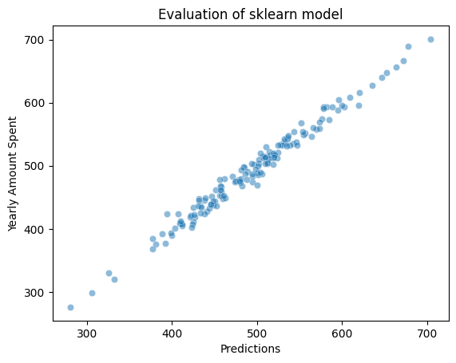

# Yearly Amount Spent Prediction by Linear Regression
## Predict Yearly Amount Spent from E-commerce website metrics:
* Average Session Length
* Time on Application
* Length of Membership

## Hand-built model vs. scikit-learn lm model:

### Predictions:
##### Hand-built (scaled)

#### sklearn.lm 

### Residuals
#### Hand-built

#### sklearn.lm

### Normality check 
#### Hand-built

#### sklearn.lm
